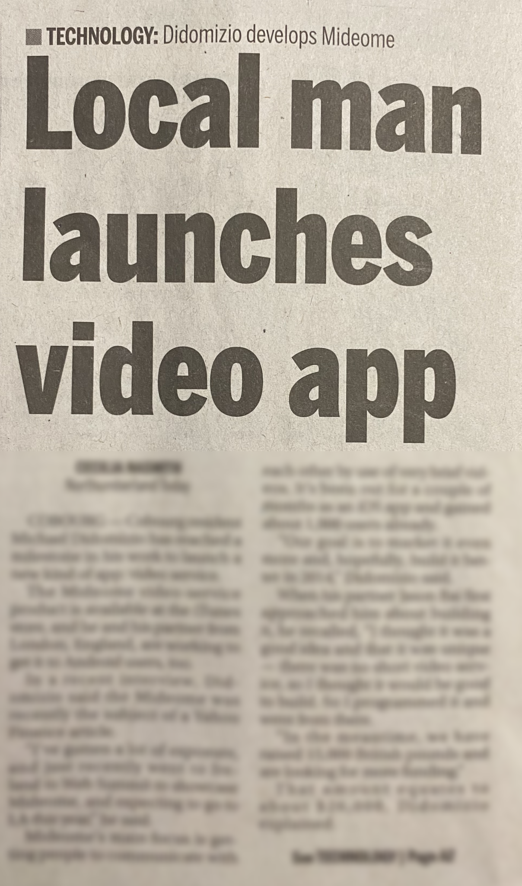

<h2>About me</h2>

My main focus is Typescript/Node but I dabble in Python, Java.  I enjoy spending time messing around coding and seeing what I can come up with.

I've worked in frontend development, backend development, mobile development, infra and automation.

Right now I really enjoy prototyping things quickly with NextJS.

<h2>What I've recently been working on</h2>

- [LaunchDorkly](https://github.com/mikedidomizio/launchdorkly) - A different or power user approach to a UI for LaunchDarkly.
- [PartyKit](https://github.com/mikedidomizio/partykit-chat) - Using PartyKit/NextJS, a concept for building different socket layers using React Context.
- [Transcriber Summarizer](https://github.com/mikedidomizio/transcriber-summarizer) - Summarize audio with AWS Transcribe and get a breakdown via OpenAI 

<h2>Media Appearances</h2>

<table>
    <thead>
        <tr>
            <td colspan="3" align="center">2021</td>
        </tr>
        <tr><td colspan="3" align="center">My work in improving locating hard to find COVID Rapid Antigen Tests in Canada.</td></tr>
        <tr>
            <td align="center">Inteview with CTV Toronto</td>
            <td align="center">Interview with CTV Ottawa</td>
            <td align="center">Inteview with CFRA 580</td>
        </tr>
    </thead>
    <tbody>
        <tr>
            <td align="center">
                
            </td>
            <td align="center">
                
            </td>
            <td align="center">
                
            </td>
        </tr>
    </tbody>
</table>

    
<h2>Older Media appearances</h2>

    <table>
        <thead>
            <tr>
                <td align="center">2014</td>
                <td align="center">2011</td>
            </tr>
            <tr>
                <td align="center">Northumberland Today</td>
                <td align="center">Northumberland Today</td>
            </tr>
            <tr>
                <td align="center">Interview on a short video application (like Tiktok/Vine) that released on iOS and desktop.</td>
                <td align="center">Interview on a website with the goal to improve shopping locally.</td>
            </tr>
        </thead>
        <tbody>
            <tr>
                <td align="center">
                    
                </td>
                <td align="center">
                     
                </td>
            </tr>
        </tbody>
    </table>

Other interviews that have been lost over time include CBC Radio One, Toronto Star, Magic 96.7 Peterborough, CHEZ 106.1 Ottawa.

<h2>How to reach me</h2>

I'm always interested in talking about coding.  So whether you'd like to talk about working together or just software development in general, reach out to me.

  
  

